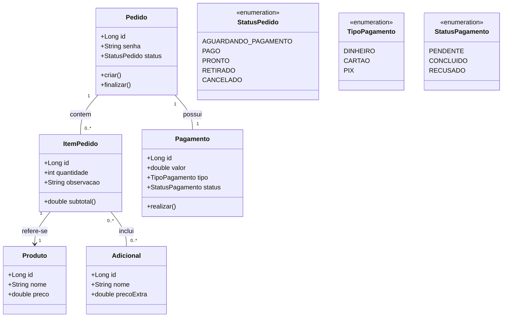
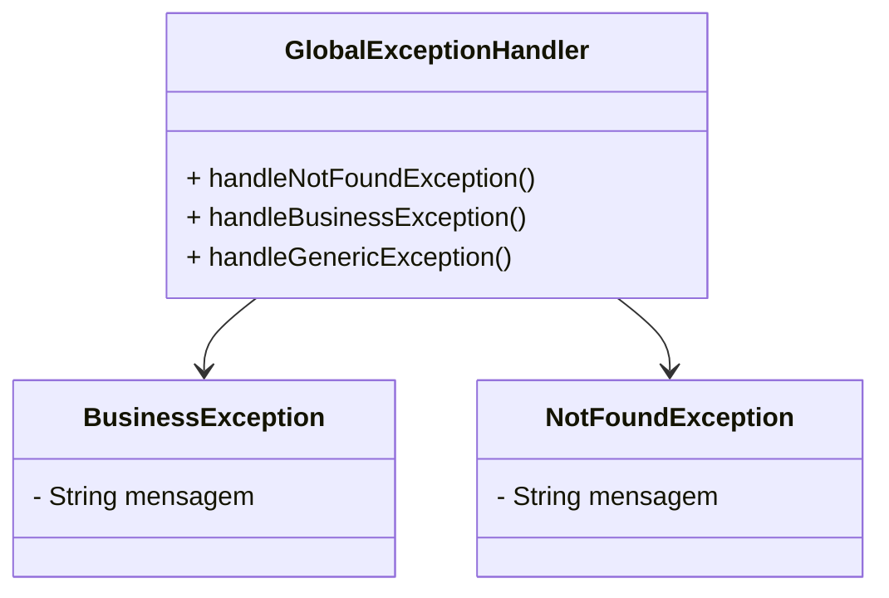

# Sistema de Cafeteria

Este documento descreve o diagrama de classes, padrões de projeto utilizados e a estrutura de pacotes do sistema de cafeteria.

---

## Diagrama de Classes (Mermaid)



## Diagrama Auxiliar - Exception Handling



---

## Padrões de Projeto Utilizados

### 1. **Singleton**
- **ProdutoManager**: controla os produtos disponíveis na cafeteria.
- **PedidoManager**: centraliza todos os pedidos feitos (de vários tablets) e os envia para o computador da loja.

---

### 2. **Factory**
- **PedidoFactory**: responsável por criar pedidos padronizados.
- **ProdutoFactory**: cria produtos de diferentes categorias (ex: `BebidaQuenteFactory`, `LancheFactory`).

---

### 3. **Decorator**
- Usado em **Adicionais** para produtos (ex: leite extra, chantilly, adoçante).  
- Permite compor produtos dinamicamente sem precisar criar subclasses para cada variação.

---

### 4. **Observer**
- Utilizado em **CentralPedidos** para atualizar automaticamente telas que exibem pedidos em andamento e prontos para retirada.
- Cada mudança de `StatusPedido` notifica todos os displays (balcão, cozinha, tablets).

---

### 5. **Strategy**
- Aplicado em **Pagamento**.  
- Cada forma de pagamento (`Dinheiro`, `Cartão`, `PIX`) é uma estratégia diferente.
- Facilita a inclusão de novos métodos de pagamento no futuro.

---

## Estrutura de Pacotes

```
br.com.cafeteria
│
├── config
│   └── SingletonConfig.java     # Configurações de instâncias Singleton
│
├── controller
│   ├── PedidoController.java    # Endpoints REST para pedidos
│   ├── ProdutoController.java   # Endpoints REST para produtos
│   └── PagamentoController.java # Endpoints REST para pagamentos
│
├── dto
│   ├── PedidoDTO.java
│   ├── ProdutoDTO.java
│   ├── ItemPedidoDTO.java
│   ├── PagamentoDTO.java
│   └── AdicionalDTO.java
│
├── exception
│   ├── GlobalExceptionHandler.java
│   ├── BusinessException.java
│   └── NotFoundException.java
│
├── model
│   ├── Pedido.java
│   ├── Produto.java
│   ├── Adicional.java
│   ├── ItemPedido.java
│   ├── Pagamento.java
│   └── enums
│       ├── StatusPedido.java
│       ├── TipoPagamento.java
│       └── StatusPagamento.java
│
├── service
│   ├── PedidoService.java       # Lógica de negócios
│   ├── ProdutoService.java
│   └── PagamentoService.java
│
├── factory
│   ├── PedidoFactory.java
│   └── ProdutoFactory.java
│
├── decorator
│   ├── ProdutoDecorator.java
│   ├── AdicionalDecorator.java
│   └── implementacoes...
│
├── observer
│   ├── PedidoObserver.java
│   ├── DisplayBalcao.java
│   └── DisplayCozinha.java
│
├── strategy
│   ├── PagamentoStrategy.java
│   ├── DinheiroPagamento.java
│   ├── CartaoPagamento.java
│   └── PixPagamento.java
│
└── singleton
    ├── ProdutoManager.java
    └── PedidoManager.java
```

---

## Observações
- O sistema não possui **Cliente** pois será utilizado direto no **tablet da loja**.  
- Cada pedido gera uma **senha única** para retirada.  
- O **Observer** garante que todos os tablets e a tela do balcão sejam atualizados em tempo real.
