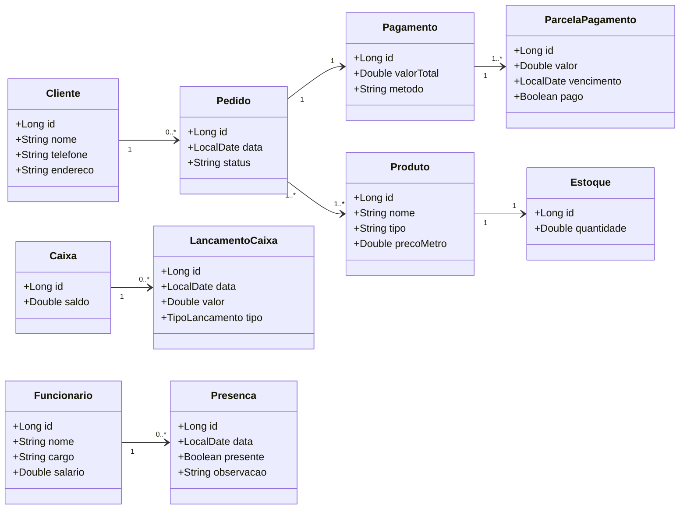
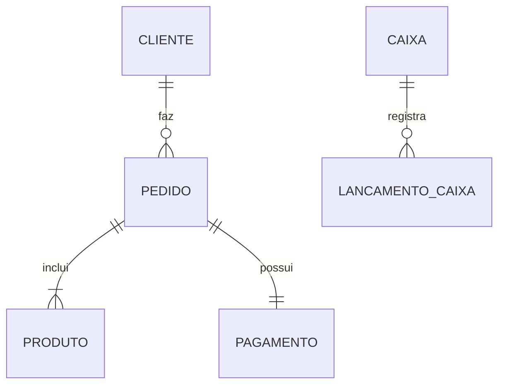

# ☕ Sistema de Cafeteria - Backend e Frontend

Este projeto foi desenvolvido para gerenciar os pedidos de uma cafeteria, permitindo a integração entre **três telas principais**:  
- **Tela de Pedido:** onde o cliente faz o pedido do café.  
- **Tela de Gerenciamento:** acessada pelos funcionários para visualizar e atualizar o status dos pedidos.  
- **Painel do Cliente:** mostra o andamento do pedido em tempo real.

O sistema foi projetado para oferecer uma experiência fluida e sincronizada entre cliente e funcionário, utilizando tecnologias modernas de **Java (Spring Boot)** no back-end e **Angular** no front-end.

---

## 🧩 Arquitetura e Padrões de Projeto

O sistema segue uma arquitetura em camadas inspirada em princípios de **Clean Architecture**, separando claramente responsabilidades entre:
- **application:** mapeamentos e conversões (DTO ↔ entidades);
- **domain:** regras de negócio e modelos principais;
- **infrastructure:** persistência e comunicação com banco de dados;
- **presentation:** controladores REST, configuração e DTOs de entrada/saída.

---

### 🏭 Padrões de Projeto Utilizados

- **Factory Method (`FabricaDeCafe`)**  
  Responsável por centralizar a criação de objetos `CafeModel`, garantindo que todos os cafés sejam instanciados de forma padronizada.  
  Isso facilita futuras alterações na forma de construir cafés (ex: diferentes tamanhos, adicionais, etc).

- **Singleton (`GeradorDeSenhaPedidoService`)**  
  Implementado para garantir que apenas uma instância do gerador de senha de pedidos exista durante o ciclo de vida da aplicação, evitando duplicidades e mantendo controle global das senhas.

Esses padrões ajudam a manter o código mais limpo, reutilizável e fácil de manter.

---

## 🚀 Funcionalidades Principais

- **Realizar Pedido** – cadastro e envio de pedidos de café.  
- **Gerenciar Pedido** – tela administrativa para controle e atualização dos pedidos.  
- **Consultar Pedido** – visualização de pedidos em andamento e prontos para retirada.  
- **Efetuar Pagamento** – registro de pagamento vinculado ao pedido.  
- **Atualização em Tempo Real** – integração via WebSocket para atualização simultânea nas telas.

*(Outras funcionalidades em desenvolvimento...)*

---

## Diagrama Estrutural



---

## Diagrama Domínio



---

## Diagrama Arquitetural

```mermaid
graph TB
    %% Direção geral de cima para baixo
    A[Controller Layer] --> B[Service Layer]
    B --> C[Repository Layer]
    C --> D[Database]

    %% Controllers
    subgraph Controller Layer
        direction TB
        AC1[ProdutoController]
        AC2[PedidoController]
    end

    %% Services
    subgraph Service Layer
        direction TB
        AS1[ProdutoService]
        AS2[PedidoService]
    end

    %% Repositories
    subgraph Repository Layer
        direction TB
        AR1[ProdutoRepository]
        AR2[PedidoRepository]
    end

    %% Banco de Dados
    subgraph Database [PostgreSQL]
        direction TB
        T1[(produto)]
        T2[(pedido)]
    end

    %% Relações
    AC1 --> AS1
    AC2 --> AS2

    AS1 --> AR1
    AS2 --> AR2

    AR1 --> T1
    AR2 --> T2


```



---


## 🛠️ Tecnologias Utilizadas

### **Backend**
- **Java 21**
- **Spring Boot 3.5.7**
- **Maven**

### **Dependências Spring Boot**
- Spring Web  
- Spring Data JPA  
- H2 Database  
- Swagger (2.7.0)  
- Spring Boot DevTools  

### **Frontend**
- **Angular 20**

---

## 📁 Estrutura do Projeto (Backend)

```
    com.spindola
    ├── application
    │ └── mapper
    │ ├── CafeMapper.java
    │ ├── ItemPedidoMapper.java
    │ ├── PagamentoMapper.java
    │ └── PedidoMapper.java
    │
    ├── domain
    │ ├── exceptions
    │ │ ├── CampoObrigatorioNuloException.java
    │ │ ├── ErroResponse.java
    │ │ ├── GlobalException.java
    │ │ └── ProdutoNaoEncontradoException.java
    │ │
    │ ├── factory
    │ │ └── FabricaDeCafe.java
    │ │
    │ ├── model
    │ │ ├── CafeModel.java
    │ │ ├── ItemPedidoModel.java
    │ │ ├── PagamentoModel.java
    │ │ ├── PedidoModel.java
    │ │ └── enums
    │ │ ├── StatusPagamento.java
    │ │ ├── StatusPedido.java
    │ │ └── TipoPagamento.java
    │ │
    │ └── interfaces
    │ └── IProduto.java
    │
    ├── domain/service
    │ ├── GeradorDeSenhaPedidoService.java
    │ ├── PedidoService.java
    │ └── ProdutoService.java
    │
    ├── infrastructure
    │ └── persistence
    │ ├── entity
    │ │ ├── CafePersistence.java
    │ │ ├── ItemPedidoPersistence.java
    │ │ ├── PagamentoPersistence.java
    │ │ └── PedidoPersistence.java
    │ │
    │ └── repository
    │ ├── CafeRepository.java
    │ └── PedidoRepository.java
    │
    ├── presentation
    │ ├── config
    │ │ └── WebSocketConfig.java
    │ │
    │ ├── controller
    │ │ ├── PedidoController.java
    │ │ └── ProdutoController.java
    │ │
    │ └── dto
    │ ├── CafeRequestDTO.java
    │ ├── CafeResponseDTO.java
    │ ├── ItemPedidoRequestDTO.java
    │ ├── ItemPedidoResponseDTO.java
    │ ├── PagamentoRequestDTO.java
    │ ├── PagamentoResponseDTO.java
    │ ├── PedidoIdResponseDTO.java
    │ ├── PedidoRequestDTO.java
    │ ├── PedidoResponseDTO.java
    │ └── PedidoSimplesResponseDTO.java
    │
    └── Main.java
```
---

## 🌐 Endpoints da API

### **PedidoController**
| Método | Endpoint | Descrição |
|:-------:|:----------|:-----------|
| `PUT` | `/api/v1/pedido/status/{id}` | Atualiza o status do pedido |
| `PUT` | `/api/v1/pedido/pagamento` | Registra o pagamento de um pedido |
| `POST` | `/api/v1/pedido` | Cria um novo pedido |
| `GET` | `/api/v1/pedido/listarRetirada` | Lista pedidos prontos para retirada |
| `GET` | `/api/v1/pedido/listarPagos` | Lista pedidos pagos |

### **ProdutoController**
| Método | Endpoint | Descrição |
|:-------:|:----------|:-----------|
| `POST` | `/api/v1/produto/cafe/cadastro` | Cadastra um novo café |
| `GET` | `/api/v1/produto/cafes` | Lista todos os cafés cadastrados |
| `DELETE` | `/api/v1/produto/cafe/{id}` | Remove um café pelo ID |

---

## ▶️ Como Executar o Projeto

### **Pré-requisitos**
- Java 21 instalado  
- Maven instalado  
- Node.js e Angular CLI instalados

### **Passos para rodar o Backend**
```bash
# Clonar o repositório
git clone https://github.com/seu-usuario/cafeteria-system.git

# Acessar o diretório
cd cafeteria-system/backend

# Rodar o projeto
mvn spring-boot:run
```

Acessar o Swagger

👉 http://localhost:8080/swagger-ui.html

Rodar o Frontend
```bash
cd cafeteria-system/frontend
npm install
ng serve
```

Acesse: 👉 http://localhost:4200

---

👤 Autor

Pedro Spíndola
💼 Desenvolvedor
🔗 [LinkedIn](https://www.linkedin.com/in/pedro-henrique-spindola?utm_source=share&utm_campaign=share_via&utm_content=profile&utm_medium=android_app)
📧 [Email](mailto:spindolaPedroHenrique99@gmail.com)
🌐 [GitHub](https://github.com/Pedro-Spindola)
💻 [Portfólio](https://pedro-spindola.github.io/portifolio/#contato)

---

📝 Observações Finais

Este projeto foi desenvolvido com foco educacional e prática de arquitetura limpa no Spring Boot, com separação em camadas (application, domain, infrastructure, presentation).
O objetivo principal é proporcionar uma experiência em tempo real de pedidos em uma cafeteria moderna.